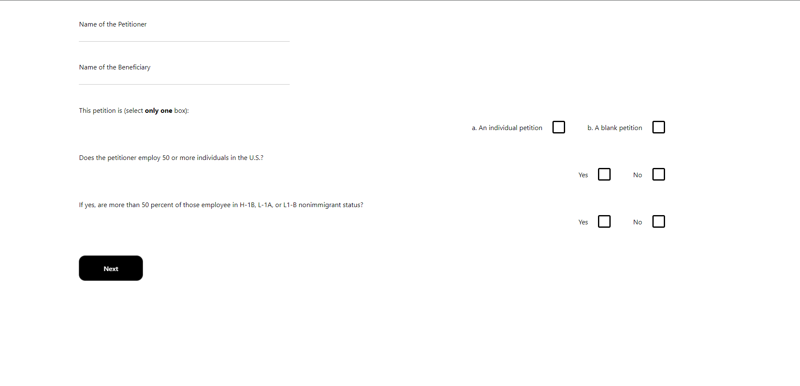
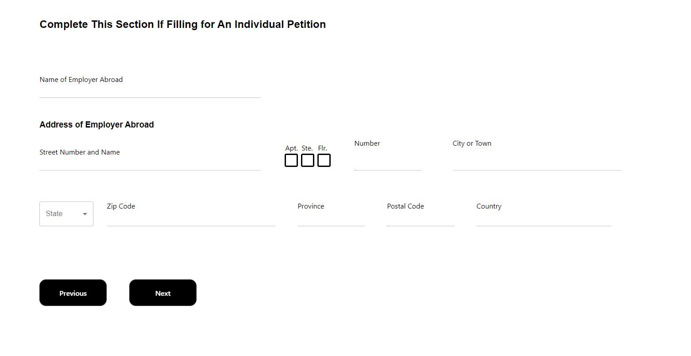
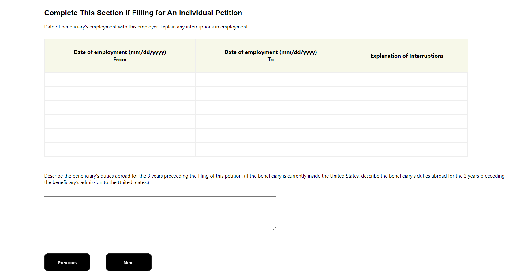

# Visa Form Website

Full-stack project for modernizing immigration form to streamline the data collection process.

Made with React.js, Springboot and PostgreSQL database hosted on AWS.

Utilized tables, dropdowns, textboxes and checkboxes for data collection.

